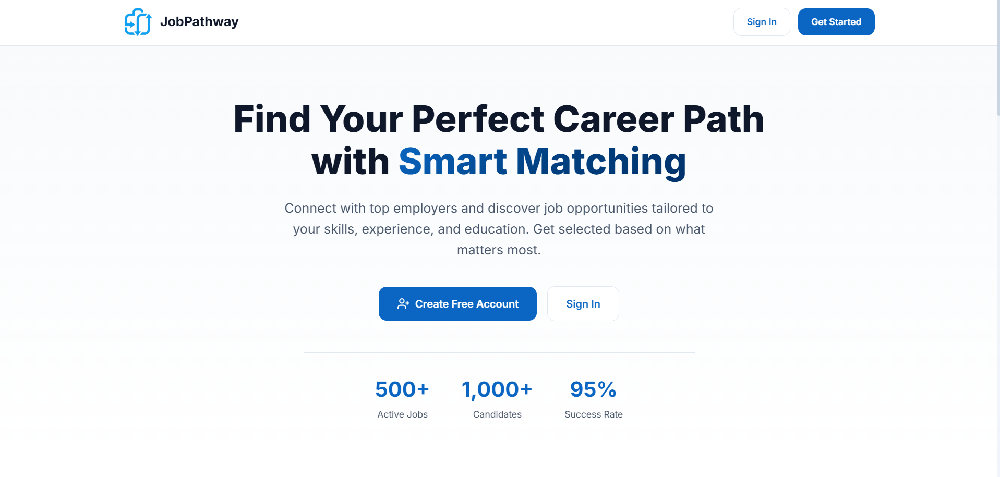
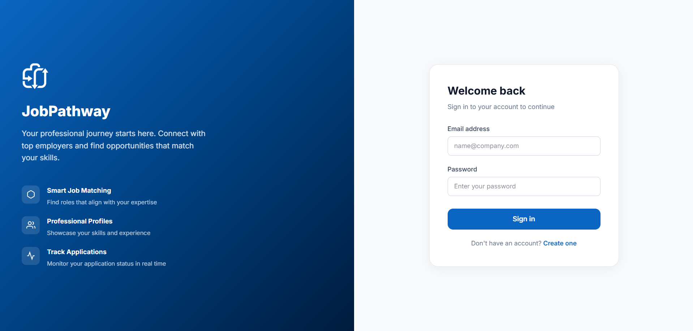
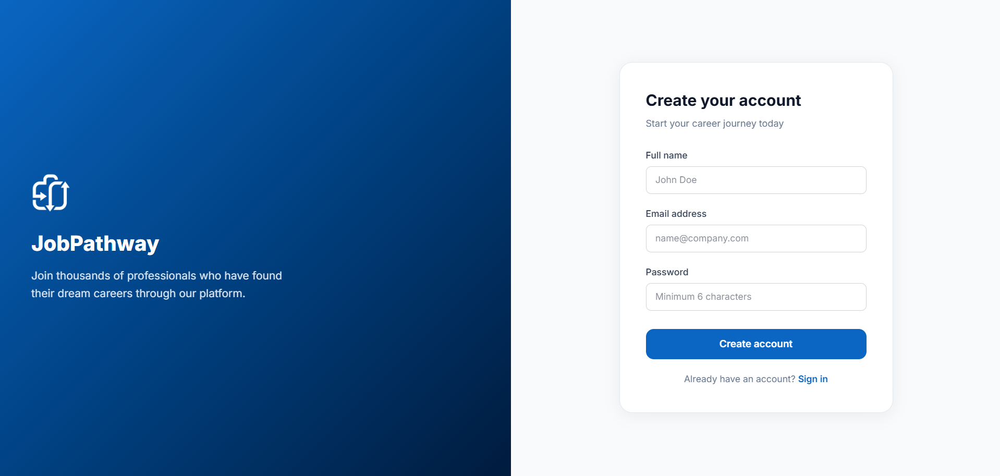
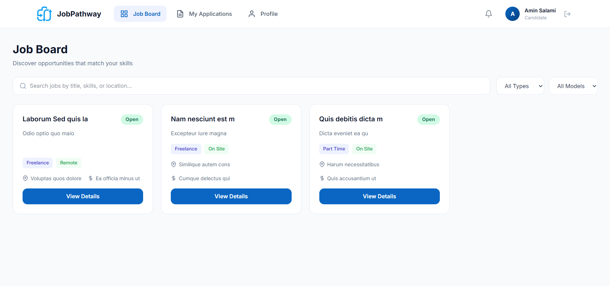
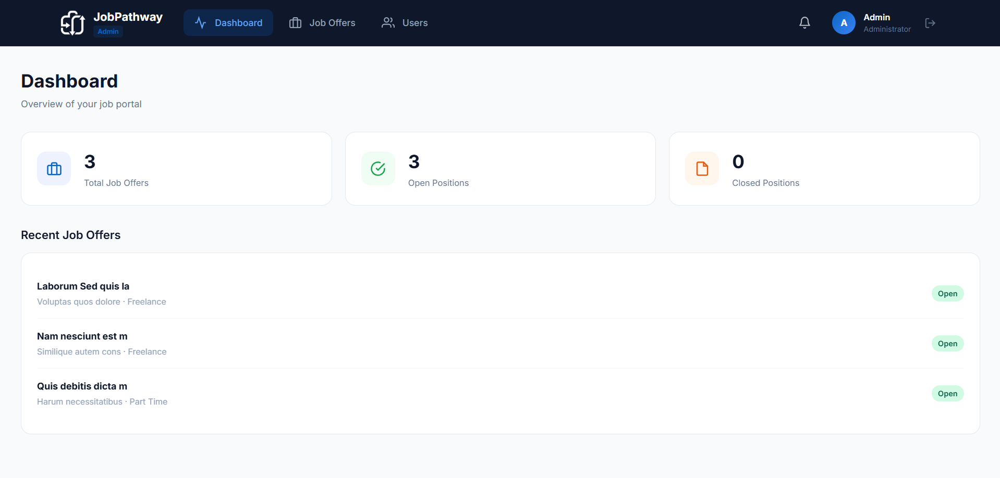

# JobPathway Frontend

A modern job recruitment platform frontend built with Angular 21, featuring role-based dashboards for candidates and administrators.


## 📋 Table of Contents

- [Overview](#overview)
- [Features](#features)
- [Tech Stack](#tech-stack)
- [Screenshots](#screenshots)
- [Project Structure](#project-structure)
- [Getting Started](#getting-started)
- [Available Scripts](#available-scripts)
- [Pages & Routes](#pages--routes)
- [Services](#services)
- [Environment Configuration](#environment-configuration)
- [API Integration](#api-integration)

## 🎯 Overview

JobPathway is a comprehensive job recruitment platform that connects candidates with employers. The frontend provides separate experiences for candidates looking for jobs and administrators managing the recruitment process.

### Key Capabilities

- **Candidates**: Browse jobs, apply with resumes, track applications, manage profile
- **Administrators**: Post job offers, review applications, schedule meetings, manage users
- **Real-time Notifications**: WebSocket-based instant notifications for both roles

## ✨ Features

### Authentication & Authorization
- JWT-based authentication
- Role-based access control (Candidate/Admin)
- Protected routes with guards
- Persistent sessions with localStorage

### Candidate Features
- Browse and search job listings
- View detailed job descriptions
- Apply to jobs with resume upload
- Track application status (Applied → Under Review → Meeting Scheduled → Accepted/Rejected)
- View scheduled meeting details with meeting links (Zoom, Google Meet, etc.)
- Manage profile information
- Upload/change profile picture
- Real-time notifications for application updates

### Admin Features
- Dashboard with recruitment statistics
- Create, edit, and delete job offers
- View and manage applications for each job
- View candidate resumes (PDF viewer)
- Update application status with notes
- Schedule meetings with candidates (includes meeting link support)
- Manage user accounts
- View candidate profiles
- Real-time notifications for new applications

### Shared Features
- Real-time WebSocket notifications
- Toast notifications for user feedback
- Responsive design with Tailwind CSS
- Loading spinners and state management
- Pagination for lists
- Confirmation dialogs for destructive actions

## 🛠 Tech Stack

| Technology | Version | Purpose |
|------------|---------|---------|
| Angular | 21.0.0 | Frontend framework |
| TypeScript | 5.9.2 | Type-safe JavaScript |
| Tailwind CSS | 4.1.12 | Utility-first CSS framework |
| RxJS | 7.8.0 | Reactive programming |
| STOMP.js | 7.0.0 | WebSocket messaging |
| SockJS | 1.6.1 | WebSocket fallback |
| Vitest | 4.0.8 | Unit testing |

## 📸 Screenshots

### Public Pages

#### Home Page

*Landing page with platform introduction and call-to-action*

#### Login Page

*User authentication with email and password*

#### Register Page

*New candidate registration form*

### Candidate Pages

#### Job Board

*Browse available job listings with search and filters*

### Admin Pages

#### Admin Dashboard

*Overview of recruitment statistics and recent activity*

## 📁 Project Structure

```
src/
├── app/
│   ├── core/                      # Core functionality
│   │   ├── guards/                # Route guards
│   │   │   ├── auth.guard.ts      # Authentication check
│   │   │   ├── role.guard.ts      # Role-based access
│   │   │   └── guest.guard.ts     # Redirect logged-in users
│   │   ├── interceptors/          # HTTP interceptors
│   │   │   └── auth.interceptor.ts # JWT token injection
│   │   └── services/              # Application services
│   │       ├── auth.service.ts    # Authentication management
│   │       ├── application.service.ts # Job applications
│   │       ├── candidate.service.ts   # Candidate operations
│   │       ├── job-offer.service.ts   # Job offer CRUD
│   │       ├── notification.service.ts # Notifications
│   │       ├── user.service.ts        # User management
│   │       └── websocket.service.ts   # WebSocket connection
│   │
│   ├── features/                  # Feature modules
│   │   ├── admin/                 # Admin dashboard
│   │   │   ├── applications/      # Manage applications
│   │   │   ├── dashboard/         # Admin home
│   │   │   ├── job-offers/        # CRUD for jobs
│   │   │   ├── layout/            # Admin navigation
│   │   │   └── users/             # User management
│   │   │
│   │   ├── auth/                  # Authentication
│   │   │   ├── login/             # Login form
│   │   │   └── register/          # Registration form
│   │   │
│   │   ├── candidate/             # Candidate dashboard
│   │   │   ├── job-board/         # Browse jobs
│   │   │   ├── job-detail/        # View job details
│   │   │   ├── layout/            # Candidate navigation
│   │   │   ├── my-applications/   # Track applications
│   │   │   └── profile/           # Manage profile
│   │   │
│   │   └── landing/               # Public landing page
│   │
│   ├── models/                    # TypeScript interfaces
│   │
│   ├── shared/                    # Shared components
│   │   └── components/
│   │       ├── confirm-dialog/    # Confirmation modal
│   │       ├── loading-spinner/   # Loading indicator
│   │       ├── notification-bell/ # Notification dropdown
│   │       ├── pagination/        # Page navigation
│   │       ├── status-badge/      # Application status
│   │       └── toast/             # Toast notifications
│   │
│   ├── app.config.ts              # App configuration
│   ├── app.routes.ts              # Route definitions
│   └── app.ts                     # Root component
│
├── public/                        # Static assets
│   ├── logo.png                   # App logo
│   └── *.png                      # Screenshot images
│
└── styles.css                     # Global styles
```

## 🚀 Getting Started

### Prerequisites

- Node.js 18+ 
- npm 9+
- Angular CLI 21+

### Installation

1. **Clone the repository**
   ```bash
   git clone <repository-url>
   cd JobPathway-Frontend
   ```

2. **Install dependencies**
   ```bash
   npm install
   ```

3. **Start the development server**
   ```bash
   npm start
   ```

4. **Open the application**
   Navigate to `http://localhost:4200`

### Backend Connection

The frontend expects the backend API to be running at `http://localhost:8080`. Ensure the JobPathway Backend is running before using the application.

## 📜 Available Scripts

| Command | Description |
|---------|-------------|
| `npm start` | Start development server at http://localhost:4200 |
| `npm run build` | Build for production (output in `dist/`) |
| `npm test` | Run unit tests with Vitest |
| `npm run watch` | Build in watch mode for development |

## 🗺 Pages & Routes

### Public Routes (No Authentication)

| Route | Component | Description |
|-------|-----------|-------------|
| `/` | LandingComponent | Home page with platform overview |
| `/login` | LoginComponent | User login form |
| `/register` | RegisterComponent | Candidate registration |

### Candidate Routes (Requires CANDIDATE role)

| Route | Component | Description |
|-------|-----------|-------------|
| `/candidate/dashboard` | JobBoardComponent | Browse all job listings |
| `/candidate/jobs/:id` | JobDetailComponent | View job details and apply |
| `/candidate/applications` | MyApplicationsComponent | Track submitted applications |
| `/candidate/profile` | ProfileComponent | Manage profile & resume |

### Admin Routes (Requires ADMIN role)

| Route | Component | Description |
|-------|-----------|-------------|
| `/admin/dashboard` | AdminDashboardComponent | Statistics and overview |
| `/admin/job-offers` | JobOfferListComponent | Manage job postings |
| `/admin/job-offers/new` | JobOfferFormComponent | Create new job offer |
| `/admin/job-offers/:id/edit` | JobOfferFormComponent | Edit existing job |
| `/admin/applications/:jobId` | ManageApplicationsComponent | Review applications |
| `/admin/users` | UserListComponent | View all users |
| `/admin/users/:id` | UserProfileViewComponent | View user details |

## 🔌 Services

### AuthService
Manages authentication state, login/logout, and JWT token storage.

### ApplicationService
Handles job application CRUD operations and status updates.

### CandidateService
Manages candidate profile, resume upload, and profile picture.

### JobOfferService
Provides job listing operations (create, read, update, delete).

### NotificationService
Manages notifications with real-time WebSocket updates.

### WebSocketService
Handles STOMP WebSocket connections for real-time features.

### UserService
Admin user management operations.

## ⚙️ Environment Configuration

The application uses hardcoded API URLs. For different environments, modify the service files:

```typescript
// Current configuration in services:
private apiUrl = 'http://localhost:8080/api';
```

For production, update to your production API URL.

## 🔗 API Integration

### Authentication Endpoints
- `POST /api/auth/login` - User login
- `POST /api/auth/register` - Candidate registration
- `GET /api/auth/me` - Current user info

### Job Offer Endpoints
- `GET /api/job-offers` - List all jobs (paginated)
- `GET /api/job-offers/:id` - Get job details
- `POST /api/job-offers` - Create job (Admin)
- `PUT /api/job-offers/:id` - Update job (Admin)
- `DELETE /api/job-offers/:id` - Delete job (Admin)

### Application Endpoints
- `POST /api/applications` - Submit application
- `GET /api/applications/my` - Candidate's applications
- `GET /api/applications/job/:jobId` - Applications for job (Admin)
- `PATCH /api/applications/:id/status` - Update status (Admin)

### Candidate Endpoints
- `GET /api/candidate/profile` - Get profile
- `PUT /api/candidate/profile` - Update profile
- `POST /api/candidate/resume` - Upload resume
- `POST /api/candidate/profile-picture` - Upload profile picture

### Notification Endpoints
- `GET /api/notifications` - Get notifications
- `GET /api/notifications/unread-count` - Unread count
- `PATCH /api/notifications/:id/read` - Mark as read
- `PATCH /api/notifications/read-all` - Mark all read

### WebSocket Endpoints
- `WS /ws` - WebSocket connection (STOMP over SockJS)
- Topic: `/topic/notifications/{userId}` - Real-time notifications


